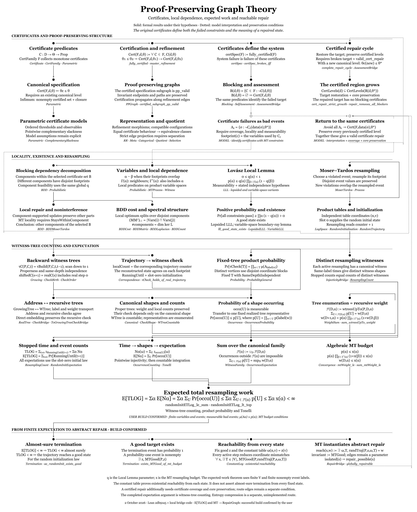

# Proof-Preserving Graphs: Formal Certification, Self-Assessment, and Repair (Lean 4)

This public development contains **191 modules of generic PPG theory**. Concrete
LUCES/nfer models, firmware, binary-memory models and measured datasets are outside
this release. The embedded system below explains the motivation; its implementation
is a separate development.

## Motivation

### The system

I built a small embedded system, an adaptive-lighting controller: a four-node mesh of Seeed Studio XIAO ESP32 boards (ESP32-S3 and ESP32-C6) with an AS7341 spectral sensor and a TSL2591 lux sensor feeding a real-time control loop, running under 2 W with no cloud and no simulation. The nodes join, authenticate, and synchronize over a message protocol designed in the π-calculus: a three-way join handshake with self-healing re-join, HMAC-authenticated challenge and response, timing-synchronized beacons, and sensor-data and registry messages across all four agents. The control logic is currently being migrated onto a custom-designed LUCES board. Weather inputs (cloud cover, humidity, solar radiation) come from the Open-Meteo API as a baseline. On top of this sits a **Monge map controller**. Across many days and weather conditions, one thing holds: weather changes the cost, but not the map. That is what makes real-time control feasible, a single precomputed, certified transport map carries the system through its daily transitions by McCann displacement interpolation, at linear cost per step. The controller has been developed and validated in simulation.

The background is in three published papers:

- "Empirical Information Geometry on an Embedded Adaptive Lighting System: Multi-Chart Manifold Transitions Under Signal Collapse," 2026. [https://zenodo.org/records/20094759](https://zenodo.org/records/20094759)
- "Excitation-Dependent Observability Geometry on an Embedded Adaptive Lighting Manifold," 2026. [https://zenodo.org/records/20389804](https://zenodo.org/records/20389804)
- "Optimal Transport Geometry of Natural Spectral Regime Transitions," 2026. [https://zenodo.org/records/21956336](https://zenodo.org/records/21956336)

### The problem

The system produces logs, and I wanted to do more than check whether those logs passed or failed. A pass/fail answer throws away the useful information. For any given run I wanted to know three things: how far the system is certified, what is stopping it from being certified further, and whether that obstruction can be repaired.

The better question is "how far does certification reach, and what blocks it from reaching further?" Once certification is graded rather than binary, a failing run is no longer a dead end: it carries a boundary (how far it got), a reason (which checks block it), and a decision (whether the block can be removed).

Today this runs offline, certifying log files against formal specifications. The direction I find most interesting is live: running the certification against the system as it runs, on the hardware itself, so it continuously knows its certified boundary, localizes whatever is blocking it, and repairs that part while running rather than after the fact in a log. That is the use case this theory is built for: certificate-driven correction, with every outcome carrying its own proof.

This repository is the formalization behind that: the certification framework, the structure of blocking, and the repair layer, machine-checked in Lean 4. The applied side, with the information-geometry background and the concrete certificate examples, lives in the companion PVS development ([luces-pvs-theories](https://github.com/gajaka/luces-pvs-theories)).

## Overview

A certificate is a predicate that says a system meets a contract. Given data and a specification level, the certificate either holds or it does not.

*(Here the certificate is kept abstract, a predicate over data and level. The concrete certificates, together with the information-geometry quantities they test, are specified in the companion PVS development, and are out of scope for this repository, which presents the formalization.)*

The specifications are not a flat list: they are ordered, from weaker contracts to stricter ones. The basic property this theory is built on is monotonicity: if a system passes a stricter contract, it also passes every weaker one. So for each piece of data there is a highest level it can be certified at, and everything at or below that level holds. This highest reachable level is the canonical level, and certification is exactly the set of levels at or below it.

Once certification is ordered this way, three questions become precise, and the theory answers each one.

First, how far does certification reach. The canonical level is the answer: it is the top of the certified region, and the theory proves it exists under the usual lattice conditions and that nothing above it can be certified.

Second, what stops it from going further. At a given level, the blocking set is the collection of certificates that fail there. It is empty exactly when that level is certified: at the canonical level and at every weaker level. A stricter level has a nonempty blocking set. Two failing certificates are coupled when they read a shared variable, and connected components identify coupled groups for repair. Different components have disjoint variable footprints, so under the locality condition (each certificate reads only its own variables) a repair confined to one component cannot change the evaluation of any certificate in another. This is the blocking dependency decomposition.

Third, whether a failure can be contained and repaired. A violating element is isolated so it cannot corrupt the certified core, and repair moves the system to a new state that is certified at least as high as before. The question that remains is whether a repair exists at all. For that the theory turns to the Lovász Local Lemma, a classical existence theorem: if each bad event has bounded dependence and sufficiently small probability, a state avoiding all of them exists. This is a strong guarantee where it applies. When the condition holds, the Local Lemma certifies that a repair exists, and the Moser-Tardos procedure constructs one by resampling violated events, with an explicit bound on the expected number of resampling steps, E[T_LOG] ≤ Σ x(α). As with the Local Lemma in general, the condition is sufficient rather than necessary: outside that zone a repair may still exist and the procedure may still succeed, but these theorems do not promise it. So the condition draws a precise boundary, inside it repair is certified and constructive, outside it the theory is silent rather than negative. A final bridge connects this back to the abstract framework: Moser-Tardos reachability is a concrete instance of the abstract repair relation, so the convergence result supplies the witness the repair layer needs, rather than assuming one.

The whole development is machine-checked in Lean 4 with no `sorry` and no additional axioms: the central theorems depend only on Lean's three standard foundational axioms (`propext`, `Classical.choice`, and `Quot.sound`, so standard that they are often called simply "the three axioms"), as confirmed by `#print axioms`. Every end state of the process carries its own proof: certified, or blocked with a reason, and when blocked, a sufficient test for whether the block admits a repair.

### Application background (separate development)

The certificates are checked against real logs at five ordered levels, S > A > B > C > D. The outcomes are not uniform, which is the point. Most logs reach canonical level C: the structure is sound, but the Monge concentration is too weak to certify at B. One run, boot334, fails at every level, because its generator coherence is negative, the spectral flow reverses mid-transition (cos = -0.74). The structural certificates pass everywhere; the dynamical one fails only on boot334. Different certificates read independent axes of the same data, and the canonical level plus the blocking set together say exactly how far each run is certified and why it stops there. The [certificate-runner results](https://github.com/gajaka/luces-pvs-theories/blob/main/CERT_RUNNER_RESULTS.md) show the certificates evaluated on these real transition logs.

The library has **1,824 explicitly declared theorems and lemmas**, with an explicit
`#check` for each. The diagram below maps certification, dependency decomposition,
probabilistic repair, finite-state decisions, expected work and stopping bounds.

### Later theory extensions

- Shearer's criterion and expected-work bounds, including blocking-component
  budgets and slack bounds; Pegden's witness-tree criterion.
- The He–Li–Sun intersection-sensitive criterion, with expected-work and
  almost-sure termination results for arbitrary measurable admissible selection
  schedules, including history-dependent rules, under the stated hypotheses.
- Positive repair witnesses, infeasibility and invariant refutations, finite
  decision procedures, and constructive repair through a supplied exact finite
  abstraction. General infinite-model repairability has an undecidability proof.
- Drift and finite rational transition models, checked potential witnesses,
  expected-time and tail bounds, closed-bad-class certificates, and exact model
  reduction through lumping.

The [complete module inventory](THEORY_INDEX.md) lists all 191 modules. Run
`python3 tools/audit_ppgraph.py` to rebuild and inspect every project declaration's
axiom dependencies, including generated theorem constants. The allowed set is
**any subset** of `{propext, Classical.choice, Quot.sound}`. The results and source
hashes are recorded in `PPGRAPH_AXIOM_AUDIT.txt` and `PPGRAPH_AXIOM_AUDIT.json`.

## Files

The table below describes the original layers. See [THEORY_INDEX.md](THEORY_INDEX.md)
for the complete current inventory, including the extensions above.

| File | Theorems | Scope |
|------|----------|-------|
| `PPGraph.lean` | 22 | Core PPG framework: validity, walks, paths, evolution, monotonicity, connectivity, separation, deterministic traversal, violation detection, certificate chains |
| `PPGraphCategorical.lean` | 10 | Categorical structure: morphisms, embeddings, quotients, refinement, simulation, composition |
| `PPGraphMeta.lean` | 10 | Meta-PPG: graphs over refinement relations, backward compatibility, upgrade chains, spec versioning |
| `PPGraphRepair.lean` | 8 | Repair semantics: isolation reversal, route bypass, locality, convergence |
| `PPGraphRR.lean` | 9 | Refinement relations: port of NASA pvslib sets_aux@rr_rel (rel_extension, RR, g/f-consistency, PPGConfig bridge) |
| `PPGraphParametric.lean` | 24 | Parametric certification: master refinement, canonical levels, lattice operators, PPG bridge, repair bounds, threshold instance |
| `PPGraphParametricQuotient.lean` | 26 | Quotient structure: cert_equiv, induced PartialOrder, CertInfClosed meet, LinearOrder separating |
| `PPGraphBlocking.lean` | 7 | Blocking certificates: diagnostic layer, canonical has empty blocking, stricter has nonempty |
| `PPGraphQuotientBridge.lean` | 5 | Bridge: spec graph projects to quotient PPG via surjective morphism |
| `PPGraphSelection.lean` | 23 | Hierarchical representative selection: pullback equiv, finest equiv, CertFamily instance via OrderDual Finset, pp_quotient bridge |
| `PPGraphComplementarySlackness.lean` | 5 | LP duality for optimal transport: pointwise CS, Monge structure, strict uniqueness, zero duality gap certificate |
| `PPGraphSelfAssessment.lean` | 12 | Failure containment, contamination impossibility, assessment trichotomy, monotone recovery (state-based, spec fixed), three evolution modes |
| `PPGraphAssessmentBridge.lean` | 8 | Bridge: self-assessment ↔ parametric certification. Complete repair cycle: strict growth + blocking cleared + canonical frontier advances |
| `PPGraphProbabilistic.lean` | 6 | Blocking dependency decomposition: dependency graph, LLL feasibility, pair infeasibility (quadratic discriminant), repair classification |
| `PPGraphLLL.lean` | 30 | General Lovász Local Lemma (Alon-Spencer 5.1.1): key inductive bound, denominator telescope, good-event lower bound, positive probability, good state exists |
| `PPGraphMoserTardos.lean` | 3 | Product probability space and resample operator |
| `PPGraphMoserTardosProcess.lean` | 2 | The resample-until-fixed algorithm as a process |
| `PPGraphMoserTardosWitness.lean` | 5 | Dependency graph and witness tree data structure |
| `PPGraphMoserTardosGrowing.lean` | 8 | Address-indexed growing tree, backward construction of the witness tree from a log |
| `PPGraphMoserTardosInjectivity.lean` | 14 | Injectivity of the witness-tree encoding: distinct resampling occurrences give distinct trees |
| `PPGraphMoserTardosWeight.lean` | 3 | Tree weight, the combinatorial quantity used in the convergence bound |
| `PPGraphMoserTardosConvergence.lean` | 2 | Algebraic core of the convergence bound (Alon-Spencer 5.7.3): tree weight bounded by the LLL weights |
| `PPGraphLopsidedLLL.lean` | 6 | Lopsided LLL (Erdős-Spencer / Harris): strict generalization of the General LLL via the lopsidependence inequality |
| `PPGraphVariableLLL.lean` | 29 | Variable-version LLL (He et al., FOCS 2017), Lemma 10: geometric GLLL reformulation, cylinder growth, boundary-point existence |
| `PPGraphBDD.lean` | 13 | Blocking dependency decomposition: components, disjoint footprints, repair non-interference (single and all-components) |
| `PPGraphBDDCost.lean` | 5 | Cost-valued non-interference: the optimal cost over a blocking set splits over disjoint components |
| `PPGraphBDDMatrix.lean` | 3 | Incidence/Gram-matrix view of dependence: dependent iff positive Gram entry |
| `PPGraphBDDLaplacian.lean` | 9 | Laplacian view: component count equals the Laplacian nullspace dimension |
| `PPGraphBDDCount.lean` | 6 | Component count equals the number of safe, independently repairable parallel units |
| `PPGraphBDDMoserTardos.lean` | 2 | Dynamic non-interference: the whole MT process confined to one component never changes another component |
| `PPGraphMoserTardosLogSpace.lean` | 1 | The C[v,t] coin-flip sample space via Measure.infinitePi (Ionescu-Tulcea) |
| `PPGraphMoserTardosRandomTrajectory.lean` | 10 | Measurable random trajectory from the log space; a concrete measurable resample policy |
| `PPGraphMoserTardosPastIndependence.lean` | 2 | The resample decision at time t depends only on log coordinates before t |
| `PPGraphMoserTardosCorrespondence.lean` | 9 | Lemma 2.1(ii): a witness tree from a genuine real trajectory passes its own τ-check |
| `PPGraphMoserTardosCheckOrder.lean` | 14 | Lemma 2.1(i) properness: equal-depth vertices have disjoint footprints |
| `PPGraphMoserTardosCheck.lean` | 1 | localCount and the decreasing-depth deterministic τ-check |
| `PPGraphMoserTardosCheckBirth.lean` | 22 | Birth step/time of tree vertices; injectivity support |
| `PPGraphMoserTardosCheckShape.lean` | 8 | τ-check depends only on the canonical shape |
| `PPGraphMoserTardosCheckInvariance.lean` | 5 | localCount/checkState/τ-check are shape-invariant (address-free counting) |
| `PPGraphMoserTardosProbability.lean` | 15 | Theorem 5.7.2: Pr[τ-check passes] factors as a product over vertices; reusable infinitePi independence lemmas |
| `PPGraphMoserTardosProbabilityGeneral.lean` | 6 | 5.7.2 for any SameDepthIndependent growing tree, not only τ_C |
| `PPGraphMoserTardosWeightSum.lean` | 16 | Σ p[T] over proper trees of depth ≤ D equals the mtWeight recursion |
| `PPGraphMoserTardosRealTree.lean` | 13 | GrowingTree → WTree bridge: real trees embed as well-formed proper WTrees |
| `PPGraphMoserTardosCanonical.lean` | 15 | Canonicalization: real tree is weight-equal to a canonical member of the enumeration |
| `PPGraphMoserTardosWTreeToGrowingTree.lean` | 11 | Direct WTree → GrowingTree embedding; same-depth independence transfers |
| `PPGraphMoserTardosWTreeCountable.lean` | 1 | Countable (WTree ι), by stratification on tree size |
| `PPGraphMoserTardosCheckBridge.lean` | 2 | Address-to-shape τ-check bridge for τ_C-built trees |
| `PPGraphMoserTardosToGrowingTreeCheckBridge.lean` | 6 | Address-to-shape τ-check bridge for toGrowingTree, no τ_C roundtrip |
| `PPGraphMoserTardosLabelsAtDepthBridge.lean` | 5 | Labels-at-depth transfer between tree representations |
| `PPGraphMoserTardosInjectivityBridge.lean` | 7 | Distinct occurrence times give distinct canonical trees; weight preserved through conversion |
| `PPGraphMoserTardosExpectation.lean` | 4 | T_LOG as a countable sum of indicators; E[T_LOG] = Σ Pr[still running] |
| `PPGraphMoserTardosResamplingCount.lean` | 14 | Decompose the stopped log by resampled event: T_LOG = Σ_α N_α; N_α = distinct canonical witnesses |
| `PPGraphMoserTardosRandomInitialization.lean` | 3 | Initial state from log slot 0, with measurability |
| `PPGraphMoserTardosRandomInitExpectation.lean` | 14 | Expectation decomposition for the random-initialization law |
| `PPGraphMoserTardosOccurrence.lean` | 7 | Witness occurrence events and their measurability |
| `PPGraphMoserTardosOccurrenceCounting.lean` | 3 | Count of distinct witnesses, canonical family |
| `PPGraphMoserTardosOccurrenceProbability.lean` | 4 | Pr[witness U occurs] ≤ weight(U) via the 5.7.2 product bound |
| `PPGraphMoserTardosWitnessFamily.lean` | 6 | Canonical enumeration of the witness family rooted at a label |
| `PPGraphMoserTardosOccurrenceExpectation.lean` | 7 | The final bound: E[T_LOG] ≤ Σ x(α); finite budgets give finite expectation |
| `PPGraphMoserTardosConstantLog.lean` | 9 | Reach a good state from any initial state via the constant log |
| `PPGraphMoserTardosTermination.lean` | 7 | E[T_LOG] < ∞ ⟹ almost-sure termination ⟹ a good state exists (measure-one, not Classical.choose) |
| `PPGraphMoserTardosRepairBridge.lean` | 8 | Moser-Tardos reachability instantiates the abstract proof-preserving repair relation |

## Central Theorems

Selected results from the original framework and its extensions. Statements
abbreviate the declared type, measurability and locality assumptions; the source
contains the full hypotheses. Random-initialization bounds use slot zero of the
resampling table. Fixed-start results specify the initial state separately.

| # | Name | File | Statement |
|---|------|------|-----------|
| 1 | `master_refinement` | Parametric | θ₁ ≤ θ₂ ∧ Cert(d,θ₁) → Cert(d,θ₂) |
| 2 | `certified_iff_above_canonical` | Parametric | Cert(d,θ) ↔ θ_c ≤ θ (principal upper set) |
| 3 | `certified_subgraph_pp_valid` | Parametric | Certified subgraph is pp_valid |
| 4 | `repair_raises_canonical` | Parametric | After repair, canonical ≤ target |
| 5 | `canonical_spec_is_canonical` | Parametric | In CompleteLattice + inf-closure, canonical exists |
| 6 | `no_repair_below_canonical` | Parametric | Cannot certify below canonical level |
| 7 | `canonical_blocking_empty` | Blocking | At canonical level, blocking set is empty |
| 8 | `separating_equiv_eq` | Quotient | Under separating family, cert_equiv implies equality |
| 9 | `lens_master_refinement` | Selection | One-liner from master_refinement via OrderDual Finset |
| 10 | `proj_is_pp_quotient` | [Selection](PPGraphSelection.lean) | With pp_valid and edges separating classes, the finest-equivalence projection is surjective and preserves graph edges |
| 11 | `cs_pointwise` | ComplementarySlackness | dual_feasible ∧ P(i,j)>0 ∧ P·slack=0 → u(i)+v(j)=C(i,j) |
| 12 | `monge_cs_strict_unique` | ComplementarySlackness | Monge + CS + strict → unique tight entry per row |
| 13 | `lll_good_state_exists` | LLL | General LLL (Alon-Spencer 5.1.1): a state avoiding all bad events exists |
| 14 | `independence_implies_lopsidependence` | LopsidedLLL | Lopsided LLL subsumes the General LLL (equality ⟹ the ≤ hypothesis) |
| 15 | `repair_noninterference` | BDD | A repair confined to one component cannot change any obligation in another |
| 16 | `mt_trajectory_localizes` | BDDMoserTardos | The whole MT process in one component never changes another component, at any step |
| 17 | `τCheck_holds_of_real_trajectory` | Correspondence | Lemma 2.1(ii): a genuine real trajectory passes its own witness-tree check |
| 18 | `logMeasure_τCheck_eq_prod_p` | Probability | Theorem 5.7.2: Pr[τ-check passes] = ∏ p(label) over the tree vertices |
| 19 | `sum_mtWeight_le` | Convergence | Σ_α w(D,α) ≤ Σ_α x(α) (algebraic MT budget bound) |
| 20 | `randomInitETLog_le_sum` | OccurrenceExpectation | **E[T_LOG] ≤ Σ_α x(α)**: the Moser-Tardos expected-work bound, no termination assumption |
| 21 | `randomInitETLog_lt_top` | OccurrenceExpectation | Finite MT budgets ⟹ finite expected work (E[T_LOG] < ∞) |
| 22 | `mtRepairGraph_globally_repairable` | RepairBridge | Moser-Tardos reachability makes the abstract proof-preserving repair globally hold |

### Extended probabilistic repair and drift

| # | Name | File | Statement |
|---|------|------|-----------|
| 23 | `Pegden.randomInitETLog_le_sum` | [MoserTardosPegden](PPGraphMoserTardosPegden.lean) | Pegden's independent-subset budget on each closed neighborhood gives random-initialized **E[T_LOG] ≤ Σ x(α)** |
| 24 | `Shearer.randomInitETLog_le_sum_stableBudget` | [ShearerExpectation](PPGraphShearerExpectation.lean) | Probability upper bounds satisfying strict Shearer positivity give **E[T_LOG] ≤ Σ q_{α}/q_∅** |
| 25 | `Shearer.randomInitExpectedComponentCount_le_budget` | [ShearerBDDExpectation](PPGraphShearerBDDExpectation.lean) | Strict Shearer on one full dependency component bounds its expected resampling count, without certifying the other components |
| 26 | `HLS.Policy.randomized_expectedWork_le_sum_stableBudget` | [HLSPolicyExpectation](PPGraphHLSPolicyExpectation.lean) | Positive event probabilities, matching-compatible intersection lower bounds and strict Shearer at **p⁻ = p − δ²/17** bound expected work by the singleton Shearer budgets, for jointly measurable admissible schedules with independent auxiliary randomness |
| 27 | `HLS.Policy.randomized_expectedWork_le_card_div_slack` | [HLSPolicyExpectation](PPGraphHLSPolicyExpectation.lean) | Under the same policy/overlap assumptions, ε > 0 and strict Shearer at **(1+ε)p⁻** give **E[T] ≤ card(ι)/ε** |
| 28 | `HLS.Policy.randomized_ae_exists_good` | [HLSPolicyExpectation](PPGraphHLSPolicyExpectation.lean) | Under the HLS policy criterion, a good state is reached almost surely under the seed/table product law; termination is a conclusion |
| 29 | `RepairDrift.ConditionalCertificate.expectedActiveCount_le` | [AdditiveDrift](PPGraphAdditiveDrift.lean) | A nonnegative integrable adapted potential with conditional decrease δ > 0 on active steps gives **E[active steps] ≤ E[V₀]/δ** |
| 30 | `RepairDrift.fullResampling_expected_work_eq` | [MoserTardosFullResampling](PPGraphMoserTardosFullResampling.lean) | If every event resamples all variables, random-initialized **E[T_LOG] = b/(1−b)** in extended nonnegative reals, with b = Pr[bad]; positive good-state mass gives finite work without an LLL test |

Here `x` denotes a resampling budget, and `q_{α}/q_∅` denotes the singleton
Shearer coefficient ratio. A component-work bound does not assert scheduling
fairness or eventual repair of that component.

### Exact finite models, stopping bounds and reduction

| # | Name | File | Statement |
|---|------|------|-----------|
| 31 | `FinitePotential.synthesize_iff_accessible` | [FinitePotential](PPGraphFinitePotential.lean) | For a fixed finite stochastic kernel with absorbing good states, checked potential synthesis succeeds **iff every state has a positive-mass path to good** |
| 32 | `FiniteResampling.ETLog_eq_potential` | [FinitePotentialExpectationMT](PPGraphFinitePotentialExpectationMT.lean) | In a valid finite MT model with global positive-mass accessibility, fixed-start **E[T_LOG] equals the exact rational potential** |
| 33 | `FiniteResampling.randomInitETLog_eq_potential_sum` | [FinitePotentialExpectationMT](PPGraphFinitePotentialExpectationMT.lean) | Under the same accessibility hypothesis, slot-zero initialization gives **E[T_LOG] = Σₛ productMass(Q,s) · potential(s)** |
| 34 | `FiniteResampling.TLog_timeout_eq_survival` | [FinitePotentialTailMT](PPGraphFinitePotentialTailMT.lean) | A valid finite MT model and fixed start give **Pr[T_LOG > N] = survival(N,s₀)**, the exact rational recurrence, without a termination premise |
| 35 | `FiniteResampling.TLog_timeout_checkedTable_blocks_le` | [FinitePotentialTailMT](PPGraphFinitePotentialTailMT.lean) | An accepted survival table with every H-step survival value ≤ b and b ≥ 0 gives **Pr[T_LOG > kH] ≤ bᵏ**, with geometric decay when b < 1 and H > 0 |
| 36 | `FiniteResampling.ETLog_checkedClosedBad_eq_top` | [FinitePotentialTailMT](PPGraphFinitePotentialTailMT.lean) | An accepted closed-bad-set certificate containing the fixed start gives **E[T_LOG] = ∞** for that kernel/policy |
| 37 | `FiniteLumpingUpdate.hitCount_projection` | [FiniteLumpingUpdate](PPGraphFiniteLumpingUpdate.lean) | Commuting updates and preserved good tests give pointwise equality of concrete/reduced stopped counts on the same input stream; concrete state may be infinite |

The finite MT rows use the declared finite variables/domains, normalized rational
marginals and first-violated-event process. Reduction transfers laws and checked
bounds under its additional mass/model hypotheses. A closed-bad-set certificate
concerns the specified kernel and starting state, rather than every possible
repair policy.

### Feasibility, refutation and decision limits

| # | Name | File | Statement |
|---|------|------|-----------|
| 38 | `RepairFeasibility.solve_isWitness_iff` | [CertifiedDecision](PPGraphCertifiedDecision.lean) | Decidable tests and an enumeration covering all admissible states give a witness **iff the obligations are satisfiable**; the other branch carries a refutation |
| 39 | `RepairFeasibility.repairByFiniteAbstraction_spec` | [FiniteAbstractionRepair](PPGraphFiniteAbstractionRepair.lean) | A supplied executable exact finite abstraction gives a concrete repair trace or checked invariant refutation; the repaired flag is true **iff a concrete good state is reachable** |
| 40 | `RepairFeasibility.minimalCore_exists` | [UnsatisfiableCore](PPGraphUnsatisfiableCore.lean) | Every finite infeasible obligation family contains a minimal infeasible subfamily |
| 41 | `RepairFeasibility.minimalCore_iff_minimalCorrectionHittingSet` | [CorrectionDuality](PPGraphCorrectionDuality.lean) | For K ⊆ B, K is a minimal infeasible core **iff it is an inclusion-minimal hitting set of B's minimal correction sets** |
| 42 | `RepairFeasibility.farkasCheck_noReachableGood` | [FarkasCertificate](PPGraphFarkasCertificate.lean) | An accepted rational Farkas certificate and a sound linear model for good states imply **no reachable good state exists** |
| 43 | `RepairFeasibility.ComputabilityLimit.no_total_repairability_decider` | [RepairUndecidability](PPGraphRepairUndecidability.lean) | **No computable total repairability test** exists uniformly for the halting-encoding infinite graph family, despite decidable state tests |

Exact abstraction requires its proved local realization obligations and an
exhaustive abstract enumeration. Correction sets remove obligations from the
chosen family. Failure of a sufficient probabilistic criterion alone remains
distinct from an impossibility certificate.

## Theory Layers

1. **Abstract framework**: Certificate families over any PartialOrder
2. **Master theorem**: Monotonicity of full certification
3. **Canonical characterization**: Satisfying set = principal upper set
4. **PPG bridge**: Specification graph is proof-preserving
5. **Blocking certificates**: Diagnostic layer (why certification stops)
6. **Relaxation vs Repair**: Formal distinction with canonical bounds
7. **Lattice operators**: Meet/join, inf-closure, compositional specs
8. **Quotient structure**: PartialOrder on quotient, LinearOrder separating
9. **Hierarchical selection**: Family of lenses, finest equiv, CertFamily instance
10. **Concrete instance**: Threshold with Lattice, self-certifying canonical
11. **Self-assessment**: Failure containment, contamination impossibility, assessment trichotomy, repair operator (S→V→S with spec fixed), monotone recovery via proof obligations
12. **Assessment bridge**: Parametric certification as instance of self-assessment. Complete cycle: canonical → blocking → repair → strict growth → blocking cleared → canonical frontier advances
13. **Blocking dependency decomposition and Local Lemma**: the blocking set decomposes by shared variable; the General Lovász Local Lemma gives a sufficient condition for the existence of a repair of a coupled component, division-free proof, positive probability of a good state
14. **Constructive repair (Moser-Tardos)**: when a component is repairable, resampling reaches a good state; resample operator, witness tree, injectivity, algebraic convergence bound (now formalized here, in both this Lean development and the PVS one)

## Related

- **PVS formalization:** [luces-pvs-theories](https://github.com/gajaka/luces-pvs-theories) - 460 machine-checked results (340 theorems + 120 lemmas), 52 theories. This covers the PPG core, the General LLL, and the base Moser-Tardos infrastructure. The final arc published here in Lean (E[T_LOG], BDD, Lopsided/Variable LLL, repair bridge) is not yet in PVS.

## Probabilistic Repair: references and scope

The existence side is the Lovász Local Lemma (Alon and Spencer, "The Probabilistic Method", 4th ed., Wiley 2016, Lemma 5.1.1), formalized in `PPGraphLLL.lean`, division-free. The constructive side is Moser-Tardos (§5.7): the resampling procedure, witness tree, injectivity, and the expected-work bound E[T_LOG] ≤ Σ x(α) by witness-tree counting, with no termination assumption (finiteness is derived). The repair bridge instantiates the abstract repair relation with Moser-Tardos reachability, so the convergence result supplies the repair witness rather than assuming one.

In PVS: the PPG core, the General LLL, and the base Moser-Tardos infrastructure. The final arc published here in Lean (the E[T_LOG] bound, the blocking dependency decomposition, the Lopsided and Variable-version Local Lemmas, and the repair bridge) is not yet ported to PVS.

## Future work

The theory now separates "the selected criterion does not certify repairability"
from "no repair exists." For finite models, and concrete models supplied with a
proved exact finite abstraction and executable realization, the decision layer
can return a repair path or a certificate that no such path exists. No algorithm
is claimed to synthesize an exact abstraction for every system.

The probabilistic repair criteria remain sufficient conditions. Shearer, Pegden
and He–Li–Sun extend the original LLL development. Finite potential witnesses and
tail certificates provide a separate route to termination and time bounds under
their checked transition-model hypotheses. A path alone does not imply such a
time bound. A closed bad class refutes repair under its specified transition
kernel; it does not refute every other repair policy.

For arbitrary infinite models, the library proves that a total general
repairability decider cannot exist. This is a limit on universal automation, not
an impossibility certificate for every individual infinite instance.

Open directions include finding useful repair witnesses beyond the available
criteria without exhaustive enumeration, and constructing tractable exact
abstractions or checked potentials for concrete systems. Physical acquisition,
native execution and hardware timing remain separate application obligations.

## Author

Dragan Stosic, MSc

## License

© 2026 Dragan Stosic. All rights reserved.

This work (theories, proofs, and source) is made available for reading, academic study, and non-commercial research use, with attribution. Redistribution, modification, derivative works, or any commercial use require prior written permission. If you are interested in using this work, including in a commercial or product setting, please get in touch: dragan.stosic@gmail.com
